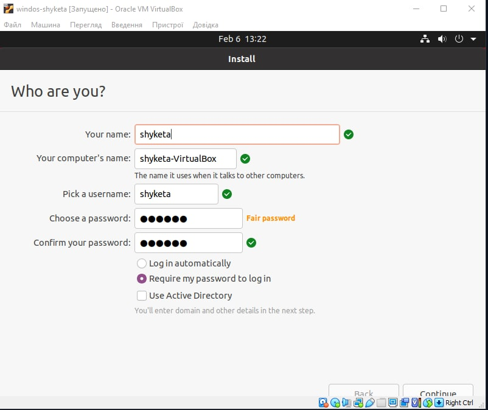
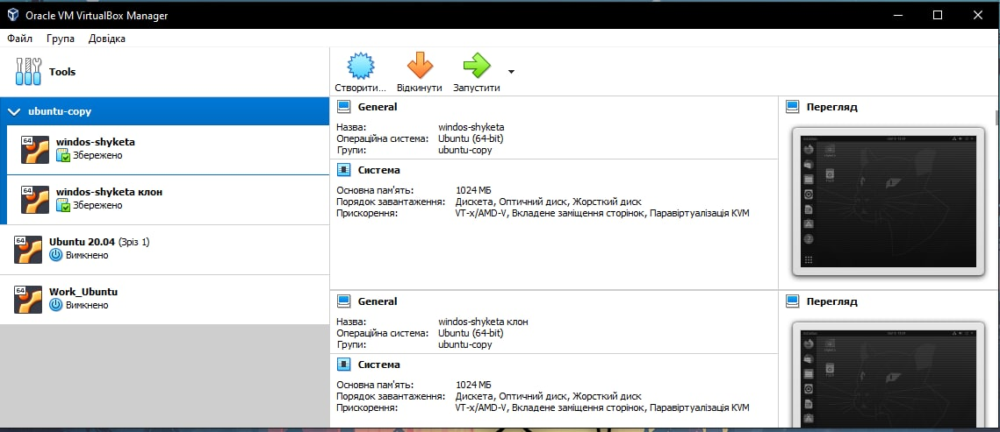
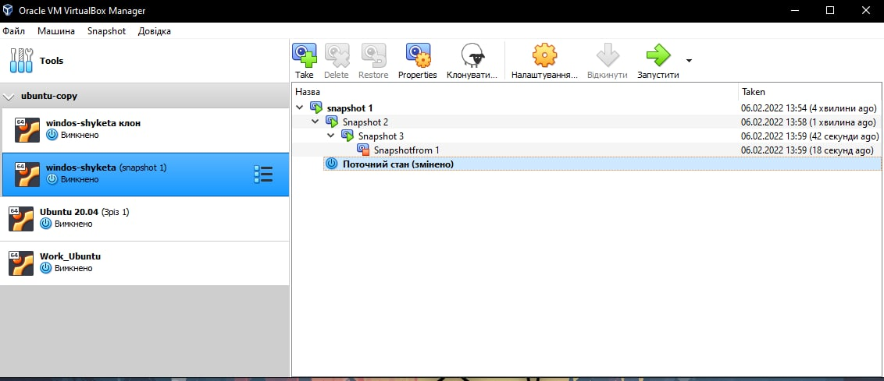
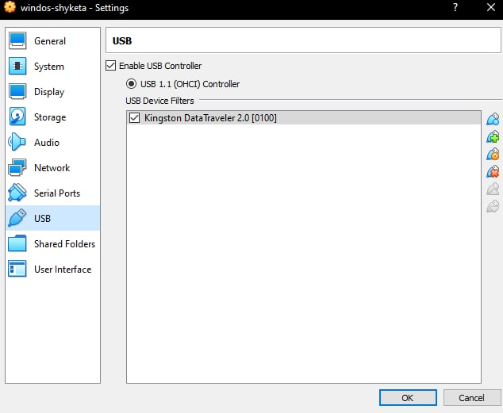
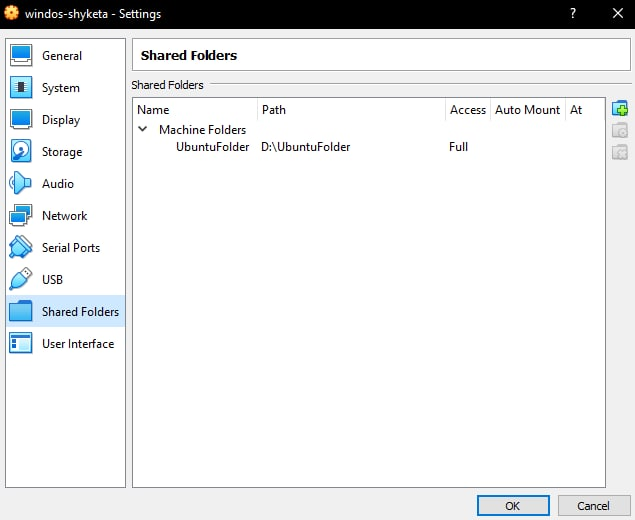
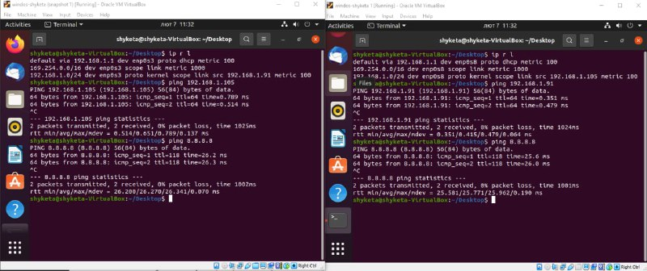
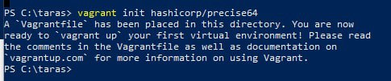
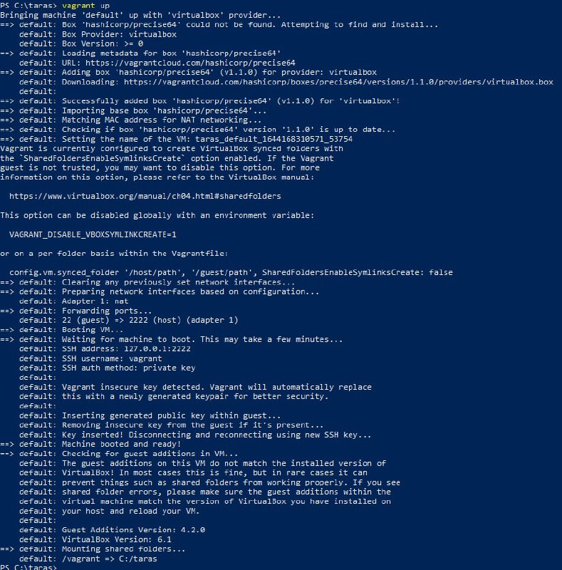
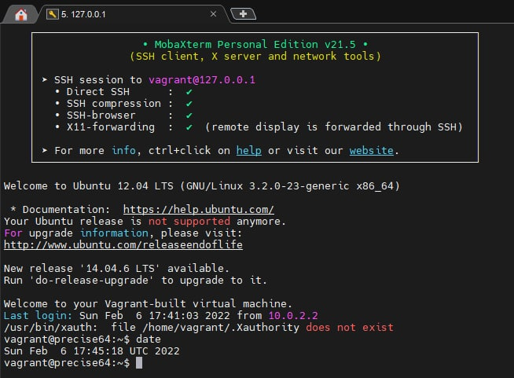
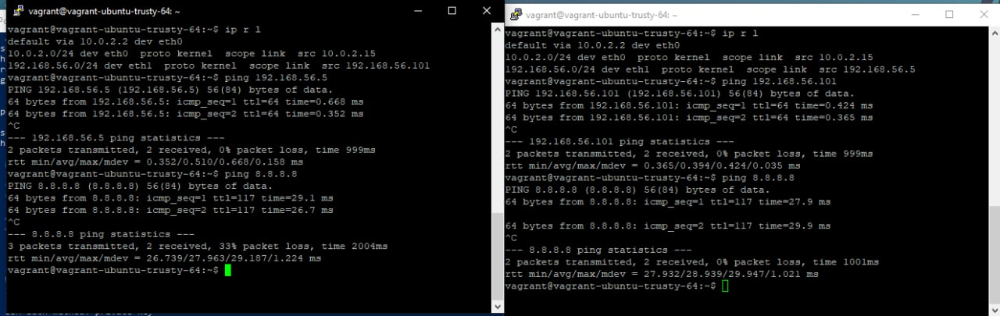

# Task 2.1
## Part 1

The most popular hypervisors for infrastructure virtualization are:

1. VMware vSphere Hypervisor
2. Microsoft Hyper-v
3. Citrix XenServer
4. Oracle VirtualBox
5. Red Hat Enterprise Virtualization Hypervisor

For example the main differences of VMware vSphere and Oracle VM VirtualBox is a hypervisor type. VMware vSphere (and Microsoft Hyper-V also) is type 1 hypervisor and it runs as a control program directly on the hardware side of the computer. Virtual machine operating systems run higher.

Oracle VM VirtualBox is a type 2 hypervisor and it runs on the host operating system and guest virtual machine operating systems are at a higher level.

## Part 2 VirtualBox

Installed the latest stable version of VirtualBox and downloaded the latest stable version of Ubuntu Desktop 20.04.3. Created VM1 and install Ubuntu



Cloned an existing VM1 by creating a VM2 and maked a group of them



Created several snapshots on VM



Exported VM1 in *.ova file to disk and imported it


Configured the USB to connect the USB ports of the host machine to the VM


Configure a shared folder to exchange data between the virtual machine and 
the host



Configured different network modes for VM1, VM2 and check the connection 
between VM1, VM2, Host, Internet



Run the cmd.exe command line and executed the basic commands of VBoxManage


## Part 3 Vagrant

Installed the required version of Vagrant. Created a folder taras and initialized default vagrant box. 



Then executed **vagrant up**



Connected to the VM using the program MobaXterm and executed the **date** command


After that created my own Vagrant box

```
# -*- mode: ruby -*-
# vi: set ft=ruby :

Vagrant.configure("2") do |config|
  config.vm.box = "ubuntu/trusty64"
  config.vm.box_check_update = false
  config.vm.provider "virtualbox" do |vb|
    vb.name = "ubuntu-test-first"
    vb.memory = 2048
    vb.cpus = 1
  end

  config.vm.synced_folder "../share-vagrant", "/vagrant_data"
  config.vm.network "private_network", type: "dhcp"

end
```

Created a test environment from a few servers

