# Task 2.2

Created AWS account, launched, configured, connected and terminated instance using the t2.micro and the CentOS operating system.

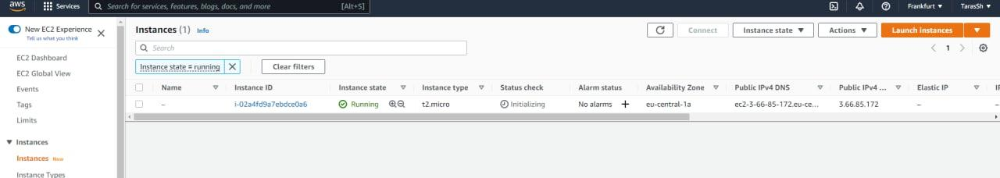

Created a snapshot of instance.

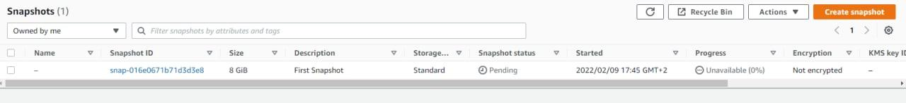

Created and attached a Disk_D to instance. Then Created and saved file text.txt on Disk_D.

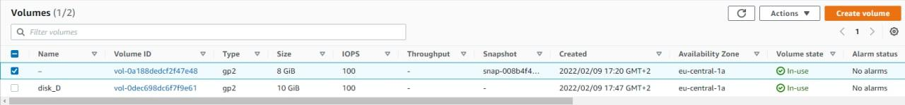

 
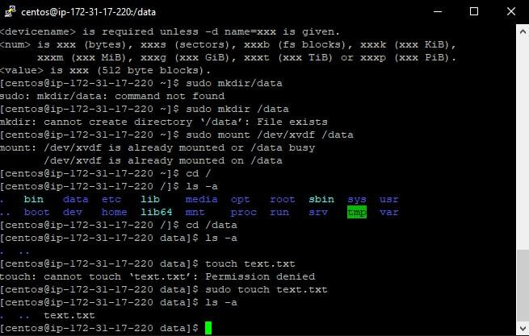

Launched the second instance from backup then detached Disk_D from the 1st instance and attached disk_D to the new instance.

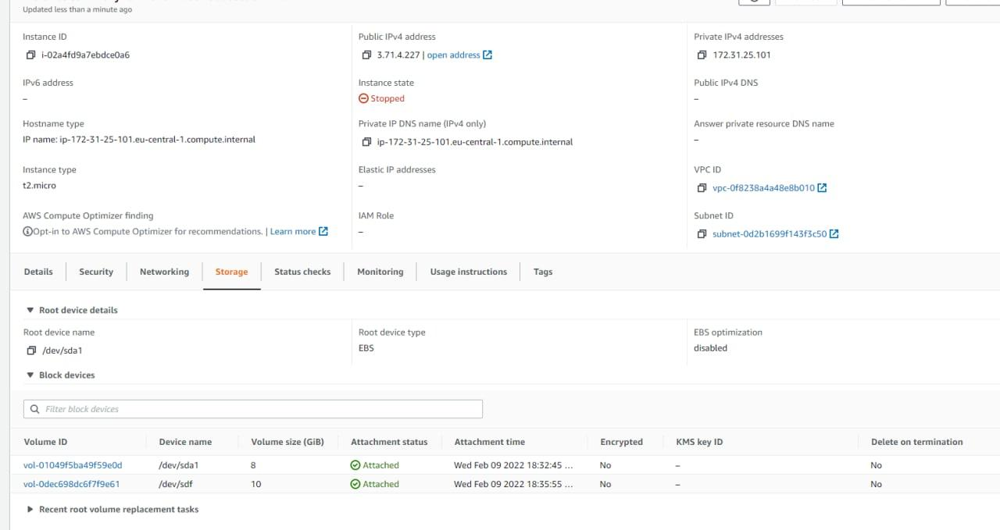

Launched and configureed a WordPress instance with Amazon Lightsail.

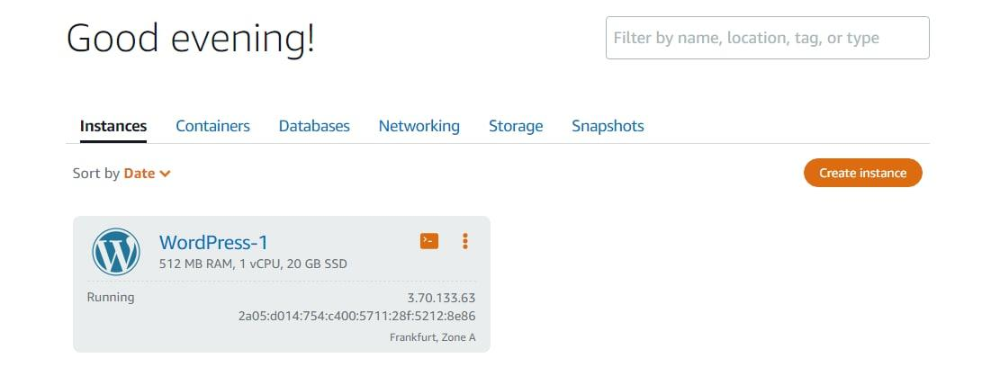

Created my own S3 bucket.

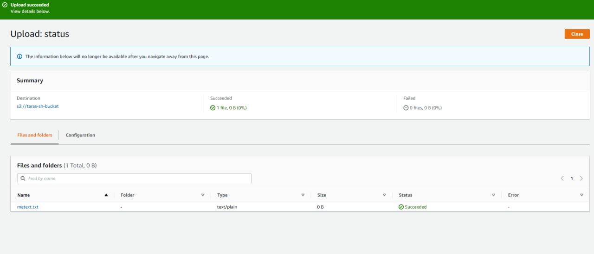

Batch uploaded files to the cloud to Amazon S3 using the AWS CLI.

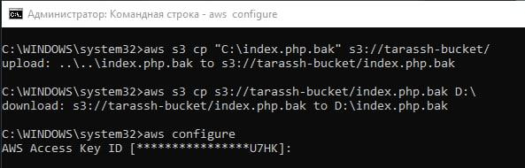

Deployed docker containers on Amazon ECS.

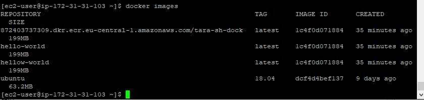
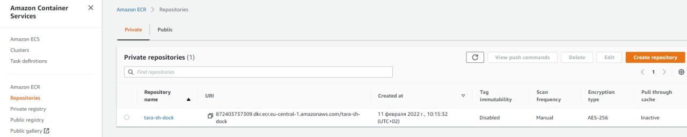

Run a serverless "Hello, World!" with AWS Lambda.

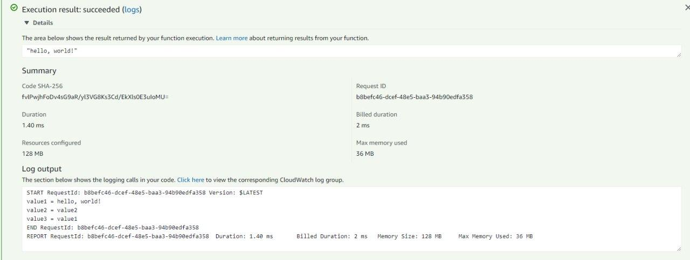

Created a static website on Amazon S3, publicly available.

http://taras-sh.pp.ua/

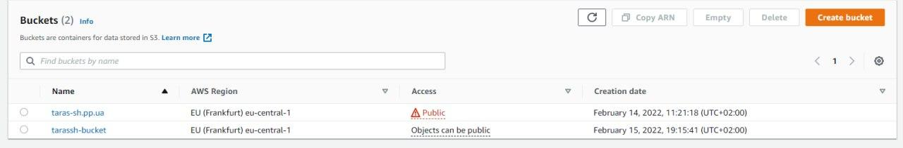
