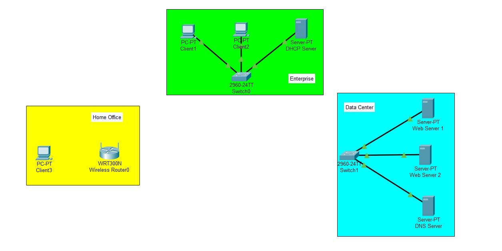
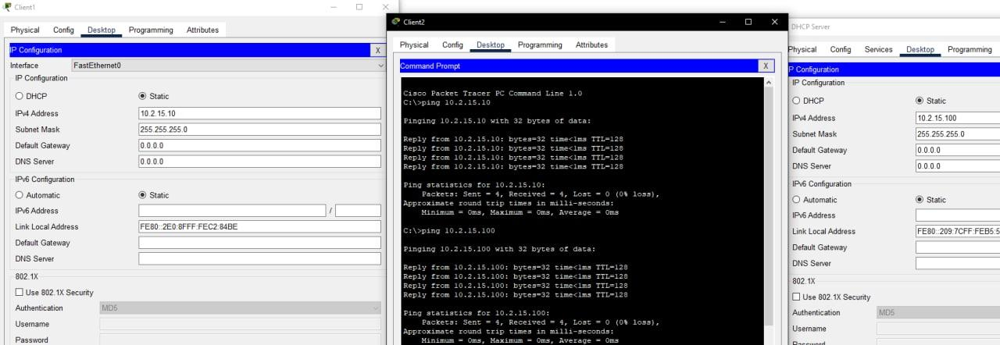
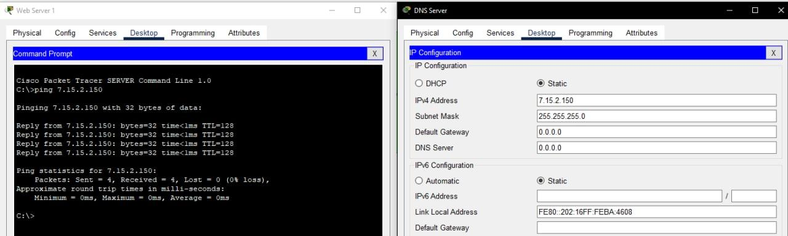
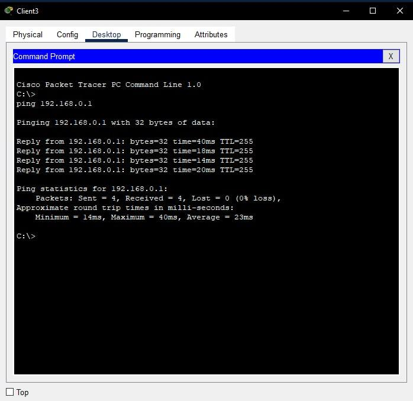
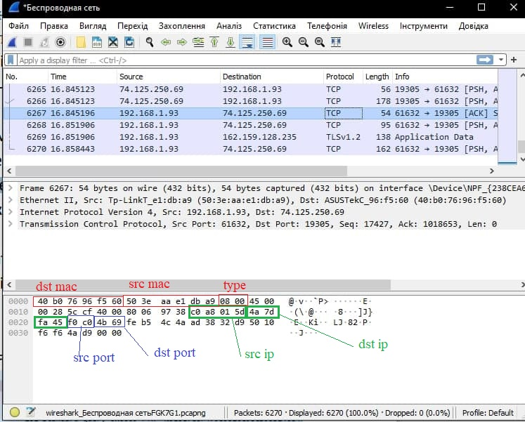

## Task 3.1

Created 3 networks in Cisco Packet Tracer

In Enterprise network appointed static addresses and 24-th mask:

* Client1: 10.2.15.10
* Client2: 10.2.15.20
* DHCP Server: 10.2.15.100

Checked the connection by running command ping

Then appointed static addresses and 24-th mask in Data Center network.

* Web Server 1: 7.15.2.50
* Web Server 2: 7.15.2.100
* DNS Server:   7.15.2.150

Checked the connection between servers by running command ping

Changed Ethernet adapter to Wi-Fi module PT-HOST-NW-1W then appointed static address to Client3: 192.168.0.25. Checked the connection to Wi-Fi module.

Installed program Wireshark. Took the screenshot of the captured network traffic and in this segment found next headlines:

* Destination MAC-address: 40:b0:76:96:f5:60
* Source MAC-address:      50:3e:aa:e1:db:a9
* Source IP-address:       192.168.1.93
* Destination IP-address: 74.125.250.69
* Source TCP: 61632
* Destination TCP: 19305