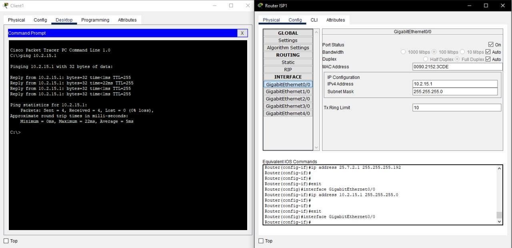
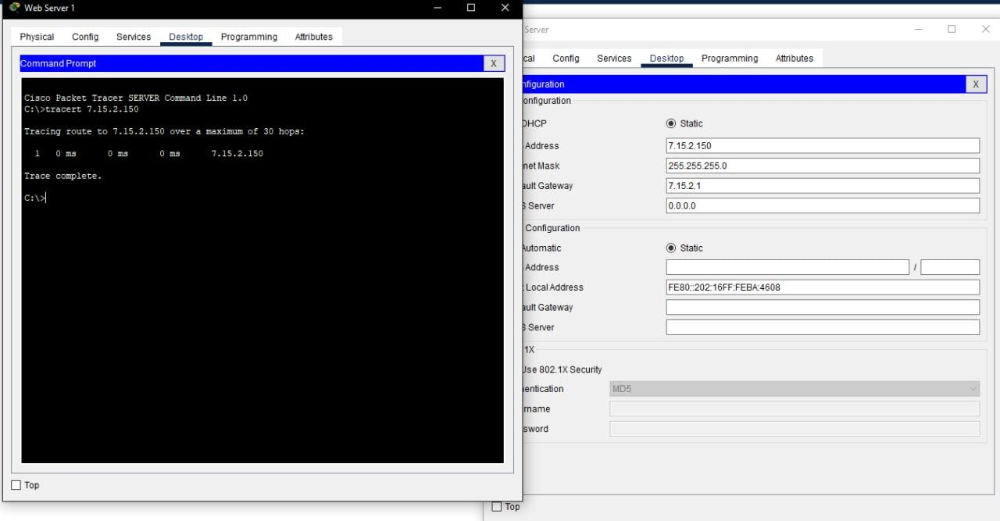
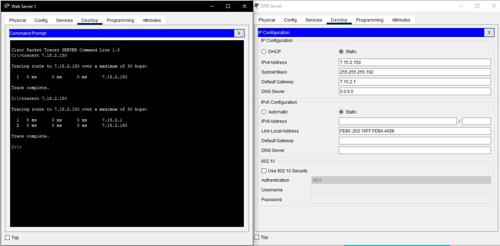
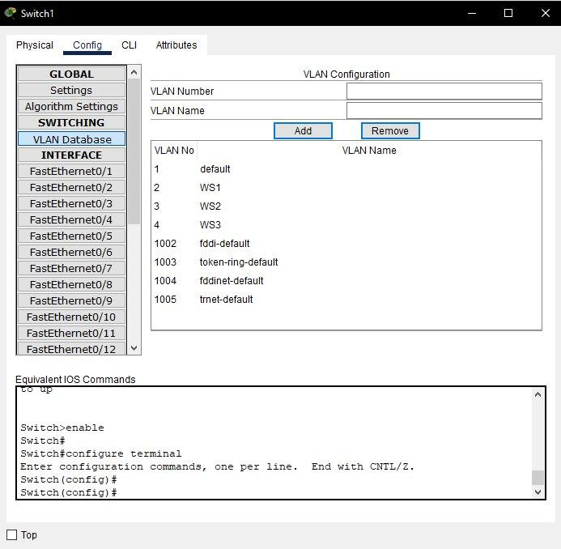
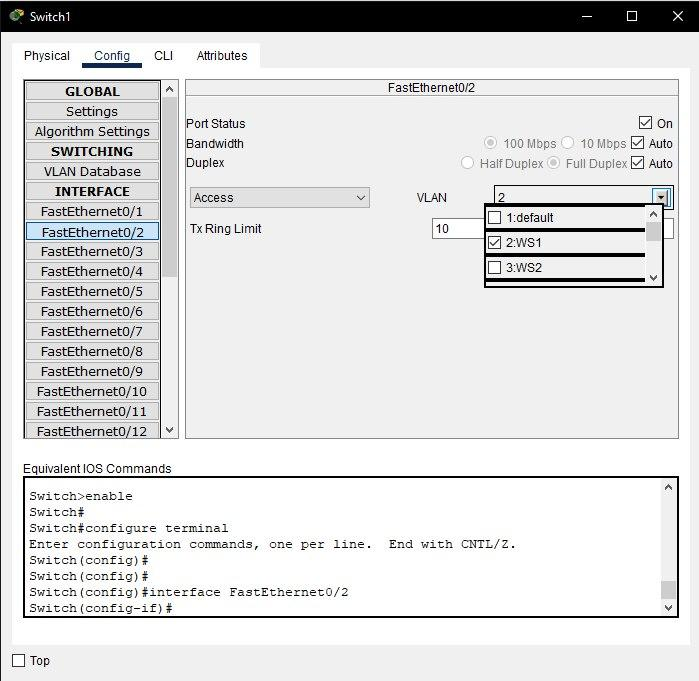
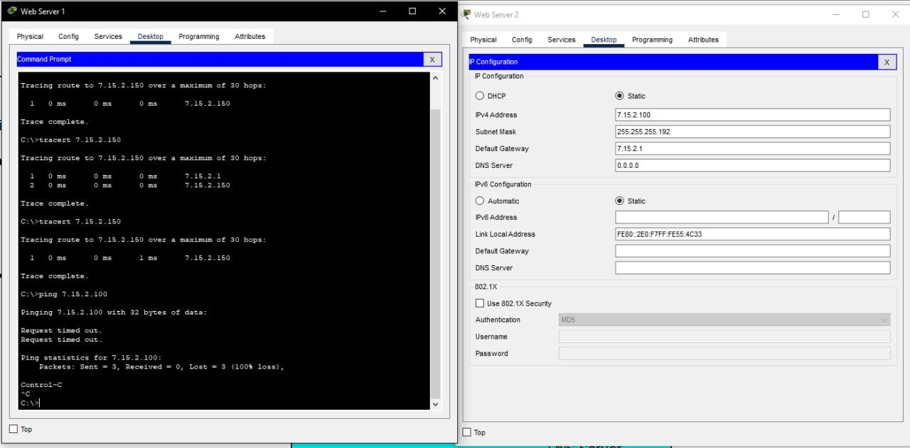
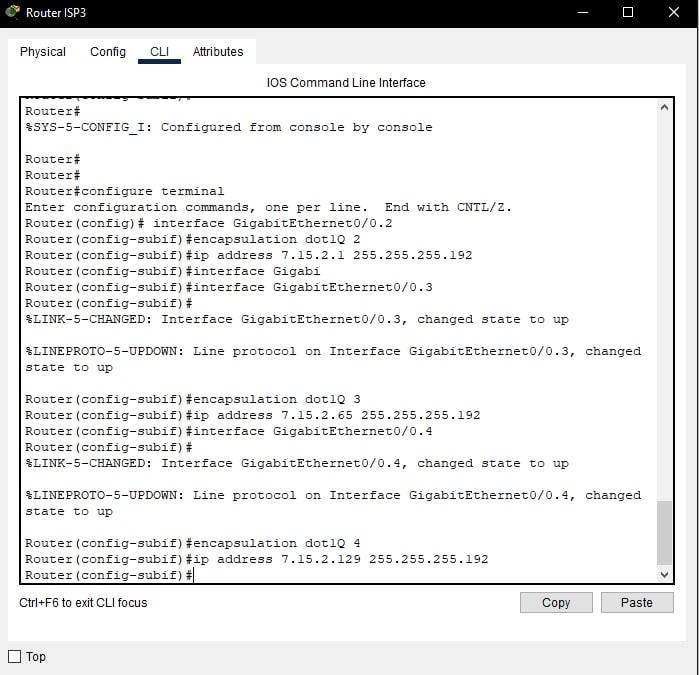
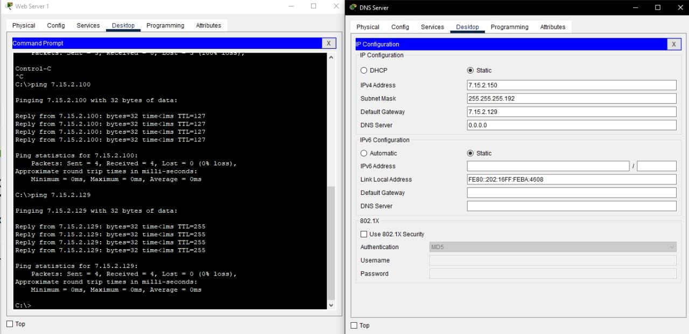

# Task 3.2
 
 Firstly, there is a need to build up "Internet" network to connect networks that were created in a previous task.

 To do that routers PT-Empty with five inserted modules 1CGE were used.
 Switches were connected to GigabitEthernet0/0 interface in each router.
 Routers IP-addresses

 Then created subnets to connect routers

### For ISP1

|Interace| Network IP-address |Host IP-address|
| -------|:------------------:| -------------:|
| GE0/0  | 10.2.15.0/24       | 10.2.15.1     |
| GE1/0  | 25.7.2.0/26        | 25.7.2.1      |
| GE2/0  | 25.7.2.64/26       | 25.7.2.65     |

### For ISP2

|Interace| Network IP-address |Host IP-address|
| -------|:------------------:| -------------:|
| GE0/0  | 25.7.2.192/26      | 25.7.2.193    |
| GE1/0  | 25.7.2.0/26        | 25.7.2.2      |
| GE3/0  | 25.7.2.128/26      | 25.7.2.129    |

### For ISP3

|Interace| Network IP-address |Host IP-address|
| -------|:------------------:| -------------:|
| GE0/0  | 7.15.2.0/24        | 7.15.2.1      |
| GE2/0  | 25.7.2.64/26       | 25.7.2.66     |
| GE3/0  | 25.7.2.128/26      | 25.7.2.130    |

Set up default gateways on other devices and run ping command.

## VLAN in Data Center

Used command **tracert** on Web Server 1 to DNS Server.

Then changed mask on servers to 255.255.255.192 and run **tracert** command again.

Now there are 2 ip addresses on image. That because router has 24-th mask on network and we used 26-th mask on servers so they need routing to communicate in network.

Then in Data Center Switch created VLAN and changed setting in interface.

Run ping command on server

There was no response from server because they were in different virtual networks and couldn't communicate with each other.

To make network work next commands where executed in router's CLI:

Then Deffault Gateway on each server were canged to:

For Web Server 1: 7.15.2.1

For Web Server 2: 7.15.2.65

For DNS Server: 7.15.2.129

And then the result of command ping will be:

