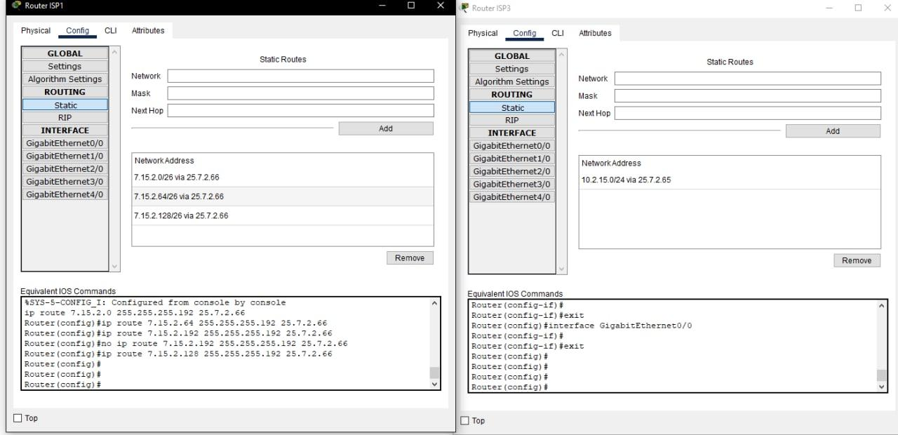
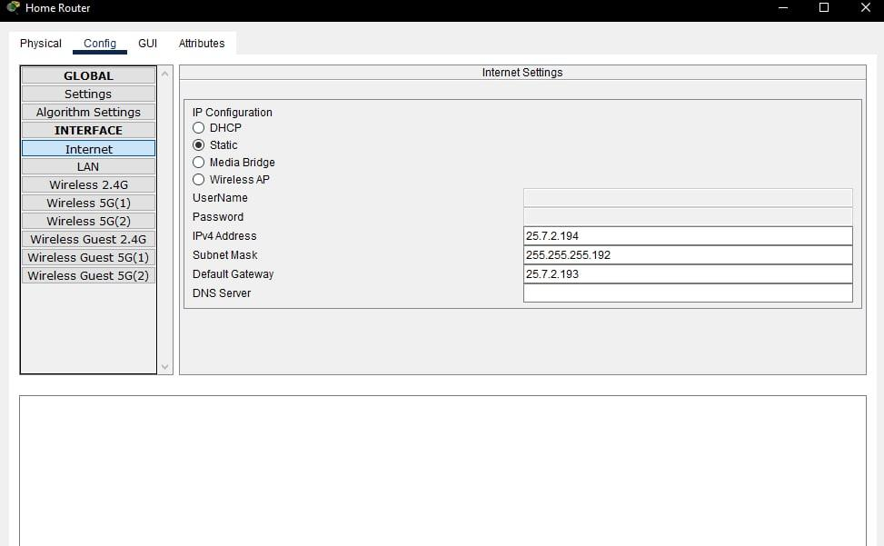
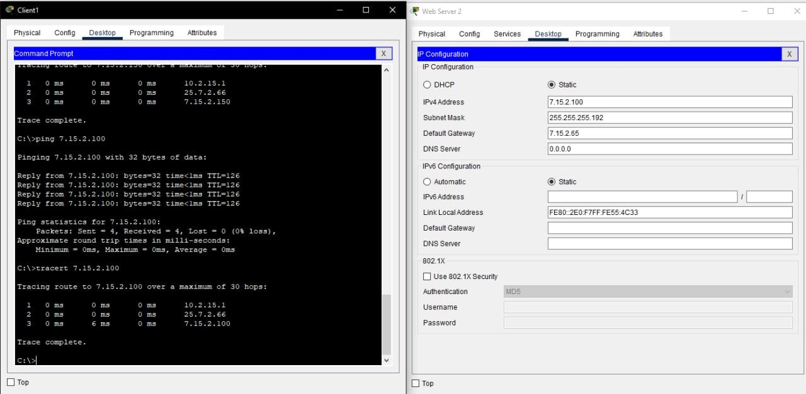
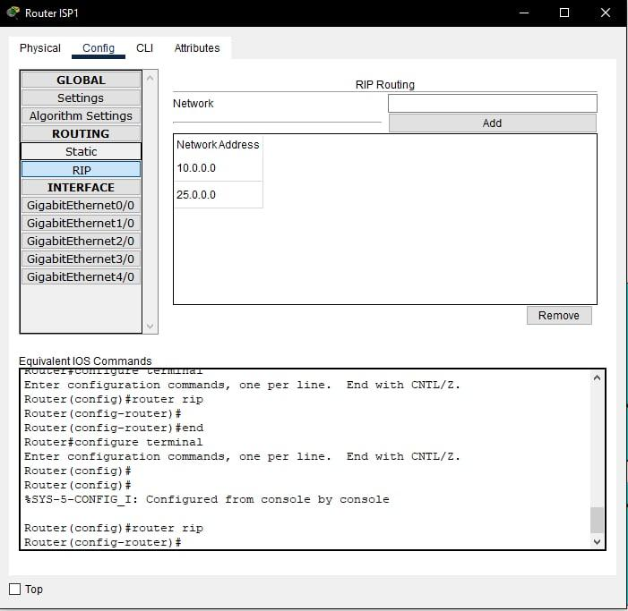
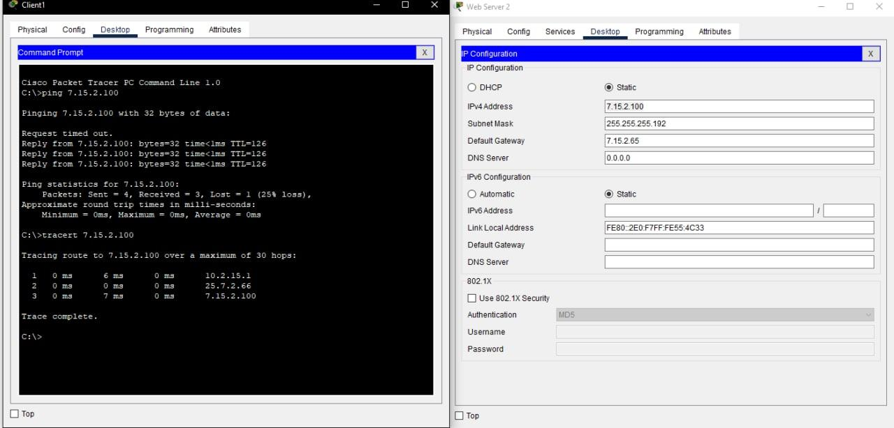

# Task 3.3

Configured static routing tables on router ISP1 ISP2 ISP3:

The ISP1 router contains 3 static network routes for each VLAN in the Data Center network.

The next step was configuring wireless Home Router. For that static ip, 26-th mask and default gateway to router ISP2 were added.

Checked connection between Client 1 and Web Server 2 by running command ping and tracert.

Deleted all static routing and added RIP protocol to routers ISP1, ISP2 and ISP3. For this list of networks was indicated in RIP routing menu. To check the connetion commands ping and tracert were run again.

