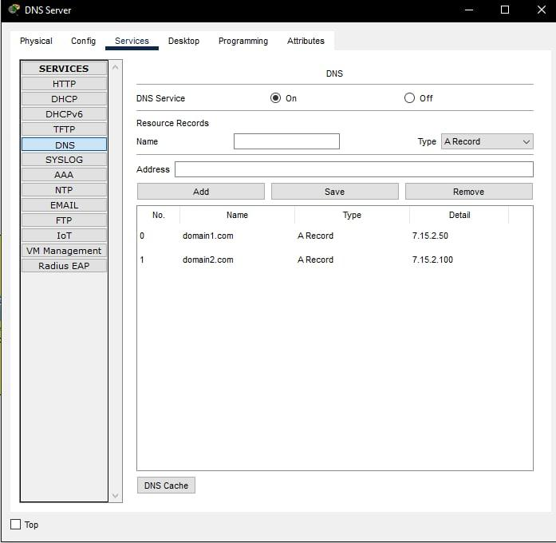

# Task 3.4

In Enterprice network configured DHCP server. Starting address set 10.2.15.10 with mask /24.

Changed IP configurations on Client 1 and Client 2 from static to DHCP.

Then changed settings on DNS server in Data Center network. Added Web Server 1 as domain1.com and Web Server 2 as domain2.com to records.

After that added DNS address to DHCP server. Again changed IP configurations on Client 1 and 2 from DHCP to static and back. On Client 1 pinged domain1.com

## Additional task

In Home Office network added new home server with address 192.168.0.100. Than redacted index.html in HTML services and in home router configured port forwarding.

Added a record about Home Server with name domain3.com and checked connection from Client1. 

