# Task 1 Part 1
1 ) Loged in system as root with command:

``sudo -i``

2 ) Used the passwd command and changed file /etc/shadow.

``passwd taras``

3 ) Determined users with command. In /etc/passwd and in /etc/group - in groups to which the user belongs its the best practice to issue permissions and restrictions for the user in a Linux system.

It is also posible that we can restrict the use of commands in the Linux environment through the definition of bash_profile for a specific user.

``cat /etc/passwd``

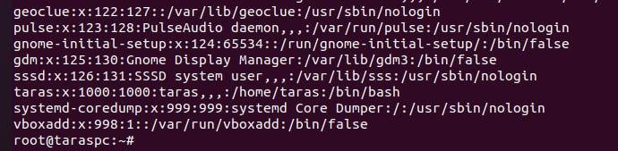

Also from this command we can see:
- Placeholder or encrypted password
- User ID
- Group ID
- Short description of the user
- Home or main directory of users
- User shell that users use to log in the system

4) Changed personal informations with commands:

``chfn -f "Taras Shyketa" taras``

``chfn -h "0992635136" taras``

5 ) Used info,man and help command.

``passwd  -d``    delete user password

``passwd -e``    expire user password

``cat -n``  number all output lines

``cat -v `` use ^ and M- notation, except for LFD and TAB

6 ) Viewed .bash* files.

bash_history
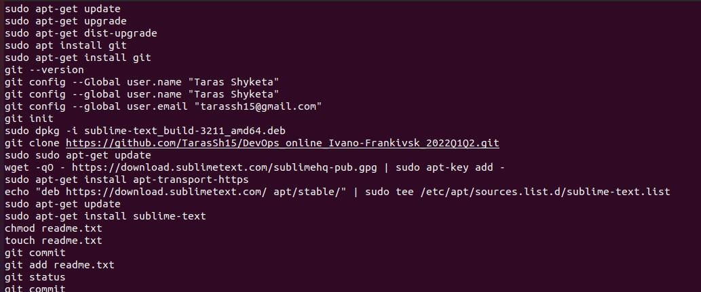
bash_logout
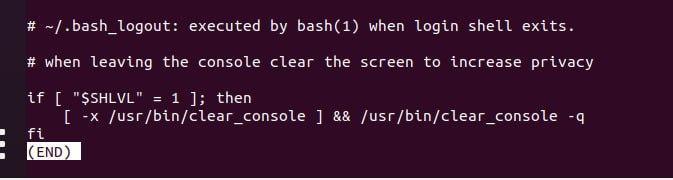
bashrc
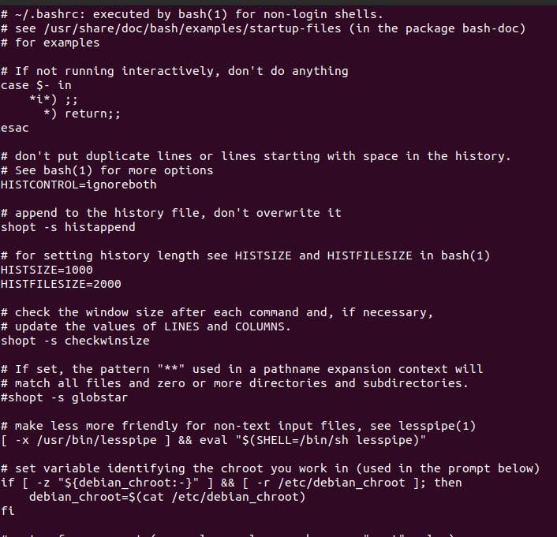

7 ) Determined the last logon time for all users.

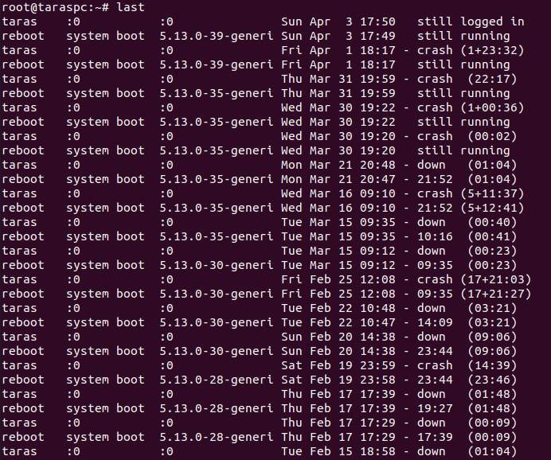

8 ) Listed the contents of the home directory. The home directory can be said as a personal working space for all the users except root

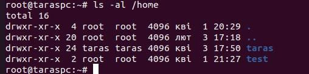

## Task 1 Part 2

1 ) Listed subdirectories of the root directory up to and including the second nesting level.

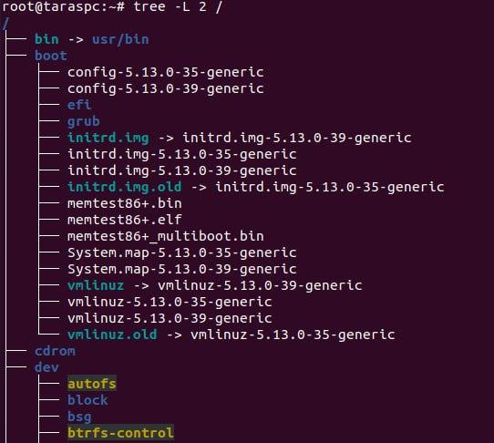

2 ) Command "file" can be used to determine the type of file.

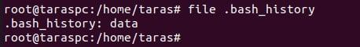

3 ) We can use command **cd ~** or **cd** to go back to home directory from anywhere in the filesystem.

4 ) Examples of listing directories using different keys:

``ls -i ~/Downloads`` to display inodes

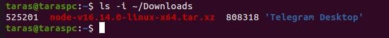

``ls -i ~/Downloads`` to display human-readable file size and sort by size

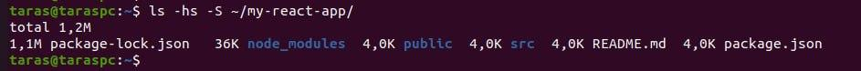

The -a optiop list files or directories including hidden files or directories. The -l option list contents of the directory in a table formath with colums including:

- content permissions
- number of links to the content
- owner
- group owner
- size of the content i bytes
- last modified date / time of the content
- file or directory name

5 )  
``mkdir /home/subdir``

``ls -al /root > /home/subdir/file.txt``

``cp file.txt ../.`` or ``cp file.txt /home/file.txt``

``cat /home/subdir/file.txt``

``rm -r -i /home/subdir``

``rm file.txt``

6 ) 

``mkdir /home/test``

``cp taras/.bash_history test/labwork2``

``ln test/labwork2 test/hard_link``

``ln -s /home/test/labwork2 test/soft_link``

- A hard link always points a filename to data on a storage device. A soft link always points a filename to another filename, which then points to information on a storage device.

``mv hard_link hard_lnk_labwork2``

``mv soft_link 'symb_lnk_labwork2 file'``

``rm labwork2``

- hard link will point to data and soft link will be dangling soft link. If the original file is deleted, the soft link is broken.

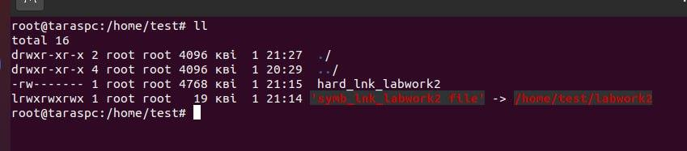

7 ) Used the locate utility to find all files that contain the squid and traceroute sequence.

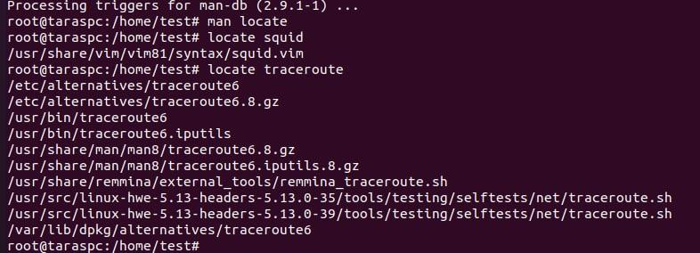

8 ) Determined which partitions are mounted in the system.

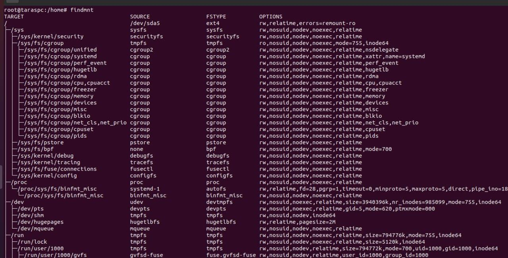

9 ) Counted the number of lines containing a given sequence of characters in a given file.

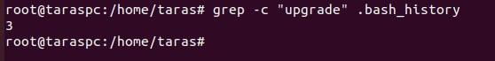

10 ) To find all files in the /etc directory containing the host character sequence we can use:

``find /etc -maxdepth 1 -name '*host*'``

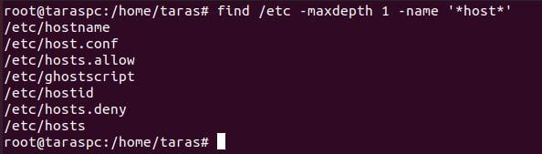

11 ) Listed all objects in /etc that contain the ss character sequence.

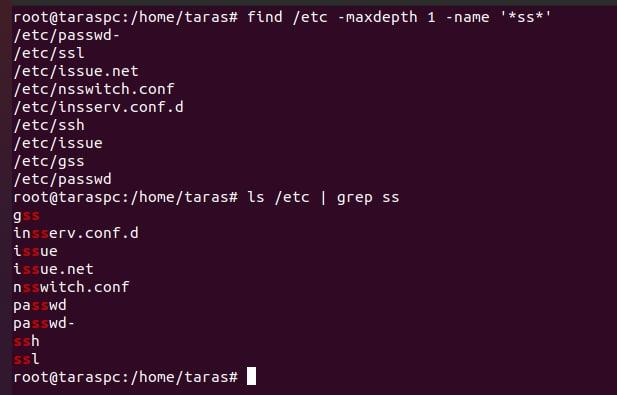

12 ) To organize a screen-by-screen print of the contents of the /etc directory we can execute.

Before we must use command **tty** to determine redirect console.

``ls /etc > /dev/pts/1``

13 ) Device files are generally stored in the /dev directory.Device files are denoted as the following:

- c - character
- b - block
- p - pipe
- s - socket

Common SCSI device files:

- /dev/sda - First hard disk
- /dev/sdb - Second hard disk
- /dev/sda3 - Third partition on the first hard disk

There are also pseudo devices:

- /dev/zero - accepts and discards all input, produces a continuous stream of NULL (zero value) bytes
- /dev/null - accepts and discards all input, produces no output
- /dev/random - produces random numbers

Sometimes in older systems we may see hard drives being referred to with an hd prefix:

- /dev/hda - First hard disk
- /dev/hdd2 - Second partition on 4th hard disk

14 ) To determine the type of file in the system we can use file command. There are ASCII text, directory, character special, rar, socket, pipe files and block files tipes.

15 ) Directory files that were recently accessed in the /etc directory can be listed with command:

``find /etc -maxdepth 1 -type f -amin -6000 | head -n 5``

- servisec
- sensor3.conf
- hostname
- timezone
- host.conf