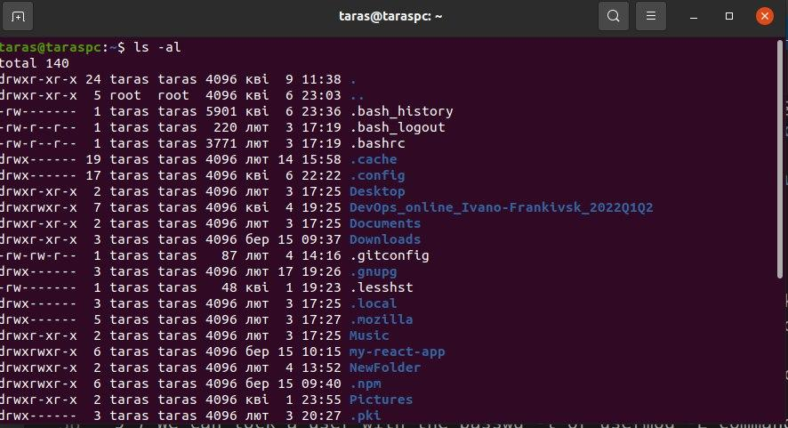
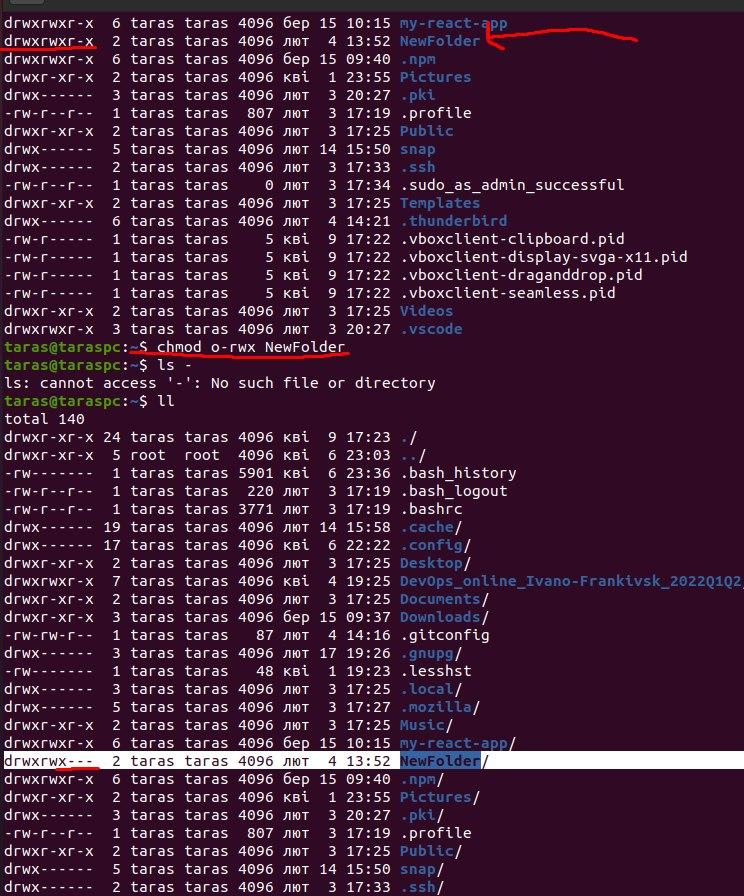

# Task 4.2

1 ) In /etc/passwd file present next fields:
- Username
- Password
- User ID
- Group ID
- comment, extended user description, for example, full name
- Home directory
- Path to shell

In /etc/group file present fields:
- Group name
- Password
- Group ID
- Group List

Only user taras exist in the system and pseudo-users like root, daemon, bit, adm, nobody and sshd. These pseudo-users accounts can be identified by UID values.

2 ) uid is a simple numeric designation for an individual user. This is usually a positive number not more than 65535 (sometimes 32-bit). Some identifiers are reserved for special use. These include 0 (root), 1-999 (daemons, pseudo-users, system and reserved users), 1000+ (regular users). 

These bogus accounts can be identified by UID values, which are typically less than 100. Typically, accounts with UIDs less than 10 belong to the system, and UIDs 10 to 100 are reserved for pseudo-users associated with special programs.

3 ) GID - unique identifier of the group within the system to which the user belongs. To define GID we can look at third filed in /etc/passwd or at the same field in /etc/group.

4 ) In /etc/group 4-th field contains group list. It is a list of user names of users who are members of the group. User names separated by commas.

5 ) Commands **useradd** can add a user and to be able to log in as the newly created user, we need to set the user password with command **passwd**. To create a user we need only **useradd** command.

6 ) We can change the name of an existing user with command **usermod** 

``usermod -l newUsername oldUsername``

7 ) Directory /etc/skel/ (skel is derived from the “skeleton”) is used to initiate home directory when a user is first created. Several user configuration files are placed in /etc/skel by default when the operating system is installed. Typically they might include .bash_profile, .bashrc, .bash_logout, dircolors, .inputrc and .vimrc.

8 ) We can use command userdel with the -r or -f option to force userdel to remove the user’s home directory and mail spool.

9 ) We can lock a user with the passwd -l or usermod -L commands.

10 ) To remove a user's password and provide him with a password-free login for subsequent password change we can use command:

``passwd -d username``

11 ) The first character indicates the file type, for example Desktop is a directory and .bash_history is a regular file. Next Symbols reflect the three types of access. Next parameters are number of (hard) links, owner name, owner group, file size in bytes , time of last modification and file/directory name.

12 ) Three sets of characters, three times, indicating permissions for owner, group and other:
r = readable
w = writable
x = executable (for files) or accessible (for directories)

For exmaple readable, writable, but not executable by group **rw-**

13 ) When the relationship between the file and the user who started the process, the role is determined as 
follows:
- If the UID of the file is the same as the UID of the process, the user is the owner of the file
- If the GID of the file matches the GID of any group the user belongs to, he is a member of the group to which the file belongs.
- If neither the UID no the GID of a file overlaps with the UID of the process and the list of groups that the 
user running it belongs to, that user is an outsider

14 ) Permissions can be changed using three commands: chown (change owner), chgrp (change group), and chmod with extended parameter format. before the access part, can list the roles "u", "g", "o" and "a" for which access is being changed.

15 ) All twelve attributes can be represented as bits of a binary number, equal to 1 if the attribute is set, and 0 if not. For example, the / tmp directory attributes will be equal 1777, the / bin / su attributes will be - 4711, the / bin / ls attributes will be - 755.

The only umask parameter is an octal number that specifies the attributes that should not be set on a new file (666) or directory (777). 

16 ) Sticky Bit is mainly used on folders in order to avoid deletion of a folder and it’s content by other users though they having write permissions on the folder contents.

When the SUID bit is set on an executable file, this means that the file will be executed with the same permissions as the owner of the executable file. With the SGID bit set, any user executing the file will have 
same permissions as the group owner of the file.

Example of files and directories with these attributes.

/usr/bin/mount

/usr/bin/passwd

/usr/bin/sudo

17 ) The #!, a special marker that designates a file type and the path to the program that interprets the commands should be present in the command script.

#!/bin/sh

#!/bin/bash

#!/usr/bin/perl

#!/usr/bin/tcl

#!/bin/sed -f

#!/bin/awk -f
