# Task 4.3

1 ) Process state codes:
- D    uninterruptible sleep (usually IO)
- I    Idle kernel thread
- R    running or runnable (on run queue)
- S    interruptible sleep (waiting for an event to complete)
- T    stopped, either by a job control signal or because it is being traced.
- W    paging (not valid since the 2.6.xx kernel)
- X    dead (should never be seen)
- Z    defunct ("zombie") process, terminated but not reaped by its parent.

- <    high-priority (not nice to other users)
- N    low-priority (nice to other users)
- L    has pages locked into memory (for real-time and custom IO)
- s    is a session leader
- l    is multi-threaded (using CLONE_THREAD, like NPTL pthreads do)

- **+** is in the foreground process group.

2 ) To highlight output the chain (ancestors) of the current process

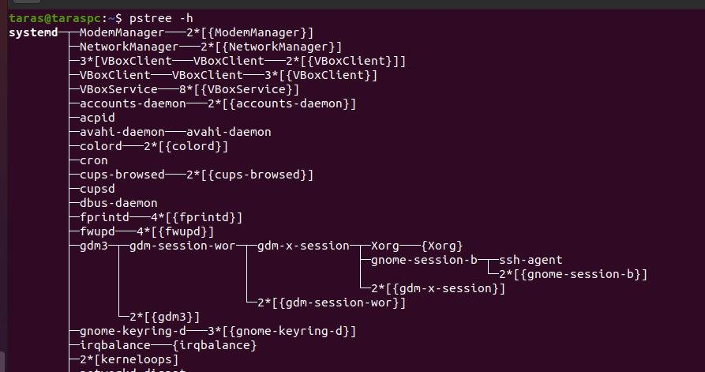

3 ) Proc file system (procfs) is virtual file system created on fly when system boots and is dissolved at time of system shut down.

4 ) Information about the processor:

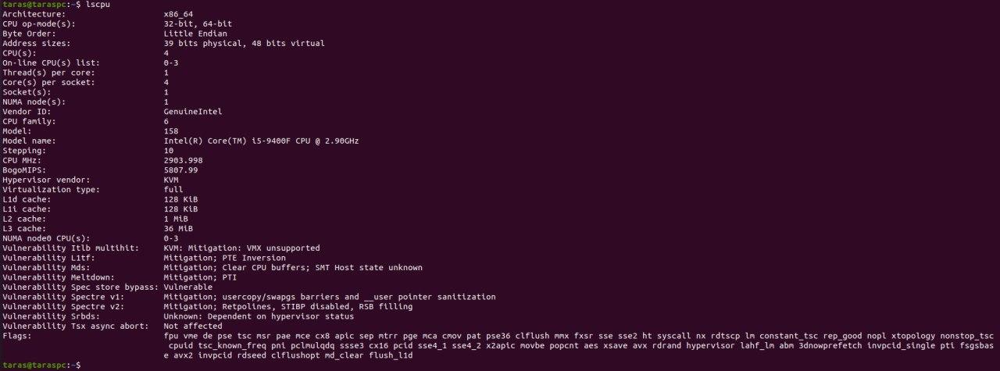

5 ) Ps to display information about the owner of the process, the arguments with which the process was launched for execution, the group owner of this process, etc.

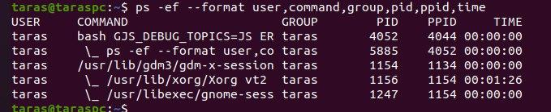

6 ) The kernel processes have a name that is between square brackets. 

7 ) To print list of processes we can use command ``ps aux`` 

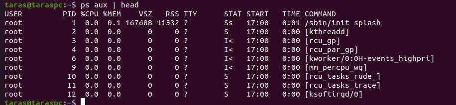

On the screenshot we can see statuses like S    (interruptible sleep) Ss (interruptible sleep that is a session leader) and I< (Idle kernel thread with high-priority).

8 ) To display processes of a specific user we can use ``ps -u``

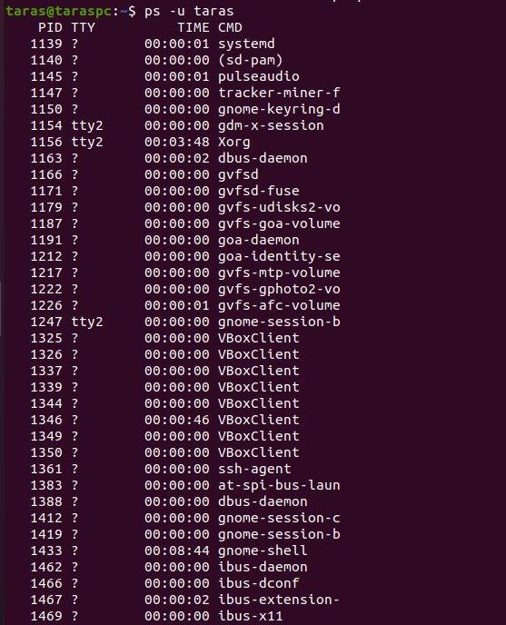

9) Utilities can be used to analyze existing running tasks are:
- top
- htop
- iotop
- iostat
- vmstat

10 ) Top command displays next information:

- PID - process identification number
- The effective username of the task’s owner
- PR - The scheduling priority of the task
- NI - Also depicts the priority of the task
- VIRT - Depicts the total amount of virtual memory used by the task
- RES - Stands for a subset of the virtual memory space representing the non-swapped physical memory a task is currently using
- SHR - Stands for a subset of resident memory (RES) that may be used by other processes
- %CPU - Stands for the task’s share of the elapsed CPU time since the last screen update, expressed as a percentage of total CPU time.
- %MEM - The task’s current share of available physical memory 
- TIME+ - Depicts the total CPU time the task has used since it started, having the granularity of hundredths of a second
- COMMAND - Displays the command line used to start a task or the name of the associated program

11 ) We can display the processes of the specific user using the command ``top -u``

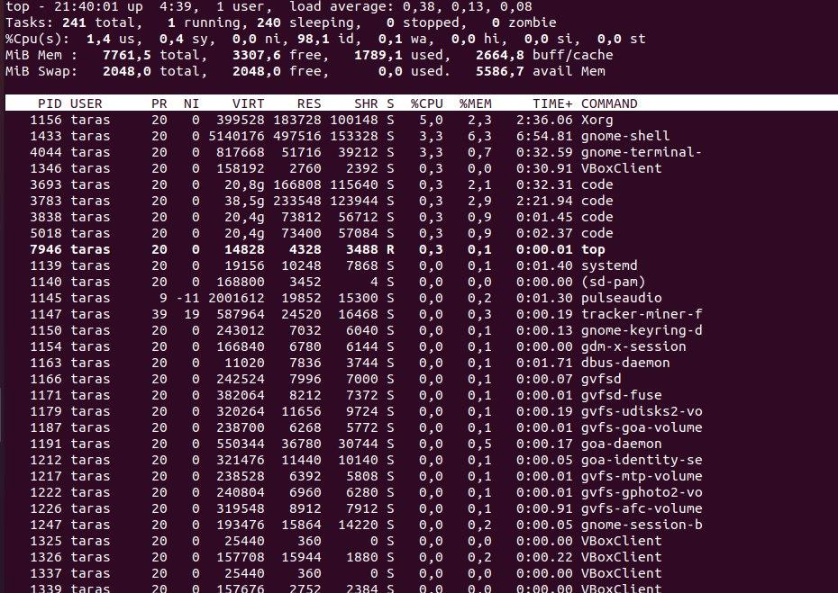

12 ) Seeing the help menu by pressing the h button. We can use the d or s button to change the refresh rate of top. The default refresh rate is 3.0 seconds. 

To quit from the top interface, we can press the q button. 

We can change the unit used for showing memory in the Summary Area from KiB by pressing E.

13 ) To sort the content we can press shift + f and choose parameter or with command ``top -o TIME+``

14 ) When Linux processes are started, they are started with a specific priority. By default, all regular processes are equal and are started with the same priority, which is the priority number 20. In some cases, it is useful to change the default priority that was assigned to the process when it was started. You can do that using the nice and renice commands. Use nice we want to start a process with an adjusted priority. Use renice to change the priority for a currently active process.

15 ) Yes, we can change priority of a process by using r command from the top utility.

16 ) We can send with the kill command process control signal like ``kill -9`` or ``kill -SIGKILL`` or ``kill -KILL``. For example to send a KILL signal to firefox, enter:

``killall -s SIGKILL firefox-bin``

17 ) Jobs command is used to list the jobs that you are running in the background and in the foreground. 

fg command moves a background job in the current shell environment into the foreground. 

bg is a process control command that resumes suspended process while keeping them running in the background. 

nohup (No Hang Up) is a command in Linux systems that runs the process even after logging out from the shell/terminal. 

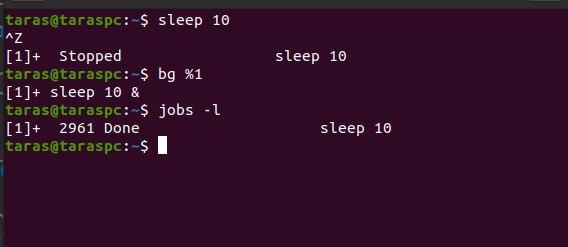

## Part 2

1 ) Most frequently used OPENSSH commands in the MS
Windows for example:

We can use ssh command to connect to a remote machine. But we woudn't be able to login as my system username does not exists on serve

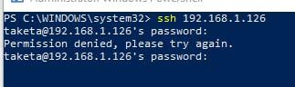

We can specify a username for SSH connection.

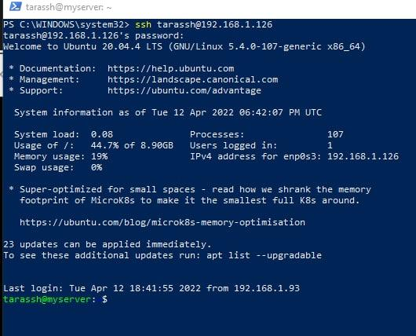

To connect to a remote host with a custom SSH port number, we can use the -p flag. For example:

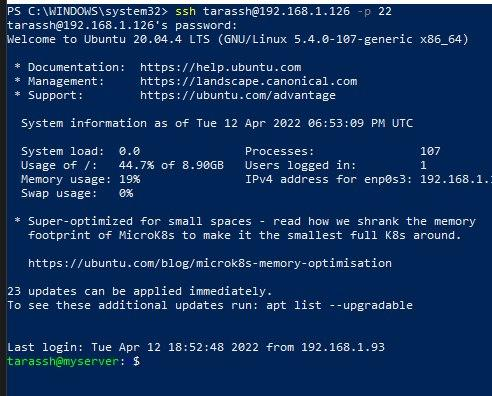

We can copy file to server with scp command:

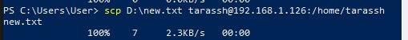

2 ) We can generate ssh key and see the publick key:

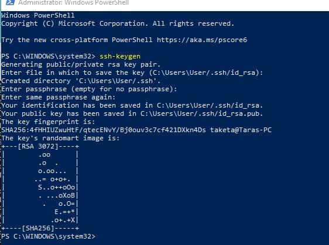
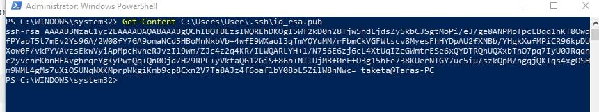

Or we can copy ssh key from server with command.

``type $env:USERPROFILE\.ssh\id_rsa.pub | ssh 192.168.1.26 "cat >> .ssh/authorized_keys"``

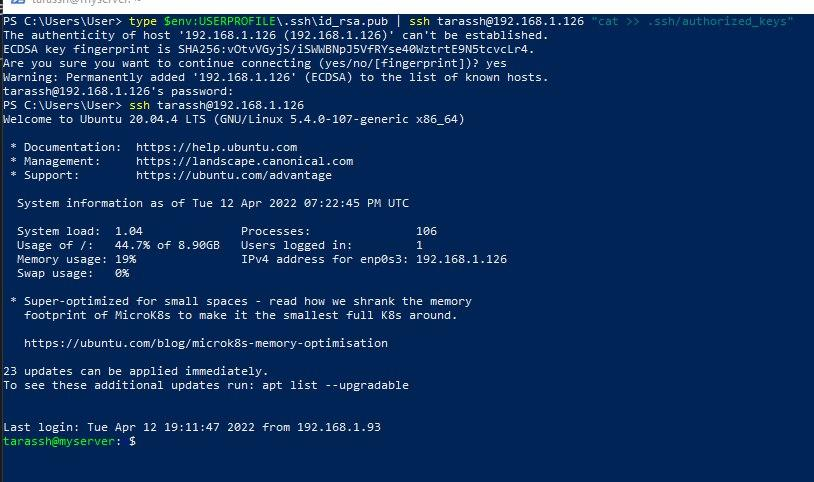

3 ) To generate SSH keys with given algorithm type, supply -t flag to ssh-keygen command. 

rsa - an old algorithm based on the difficulty of factoring large numbers. A key size of at least 2048 bits is recommended for RSA; 4096 bits is better. RSA is getting old and significant advances are being made in factoring. RSA is the default key type when generated using the ssh-keygen command. 

dsa - an old US government Digital Signature Algorithm. It is based on the difficulty of computing discrete logarithms. A key size of 1024 would normally be used with it. DSA in its original form is no longer recommended.

ecdsa - a new Digital Signature Algorithm standarized by the US government, using elliptic curves. This is probably a good algorithm for current applications. Only three key sizes are supported: 256, 384, and 521 bits. 

ed25519 - this is a new algorithm added in OpenSSH. Support for it in clients is not yet universal. Thus its use in general purpose applications may not yet be advisable.

4 ) Configured port forwarding for the SSH client from the host machine to the guest Linux virtual machine behind NAT.

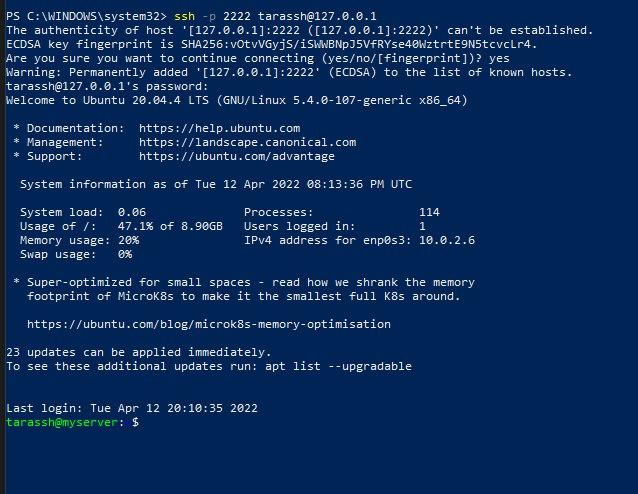

5 ) From intercepted traffic with tcpdump while authorizing the remote client on the server using ssh we can see authorizing request from my router router.asus.com.domain as we used port-forwarding to myserver.ssh with ip 10.2.2.64322.

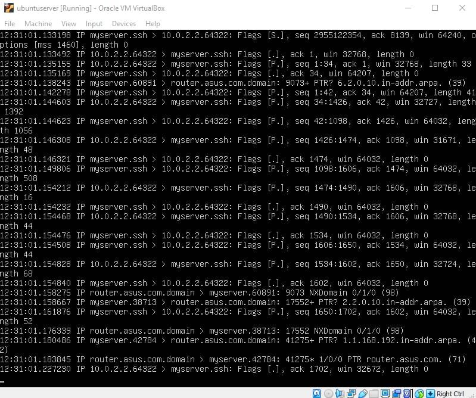