# Task 5

1 ) On Server 1 configured static IP addresses on 3 interfaces via netplan.

On Int1 - 192.168.1.110

Net2 – 10.2.15.0/24

Net3 – 10.7.2.0/24

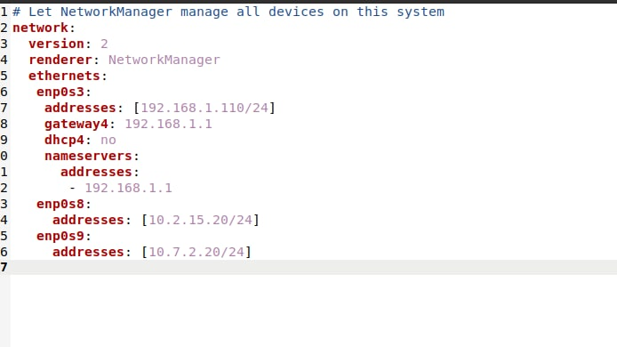

2 ) Also installed DHCP with command:

``sudo apt install isc-dhcp-server``

Then configured /etc/dhcp/dhcpd.conf file:

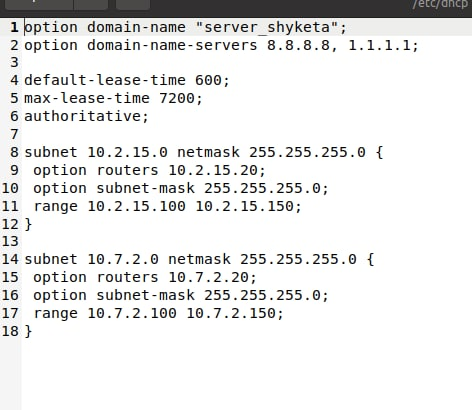

And restarted DHCP service with command:

``sudo service isc-dhcp-server restart``

To check verify if service is working correctrly we can use command ``sudo service isc-dhcp-server status``

3 ) Then configured static route on wi-fi routher and run ping and traceroute commands on server and clients.

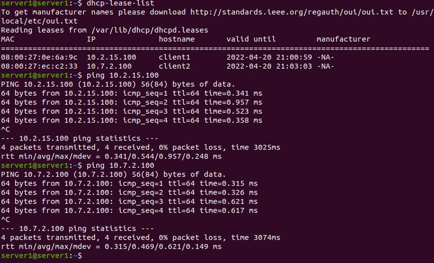

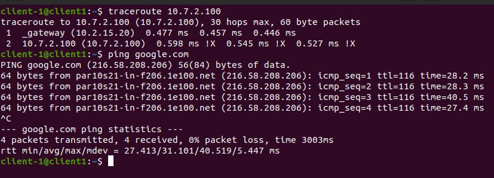

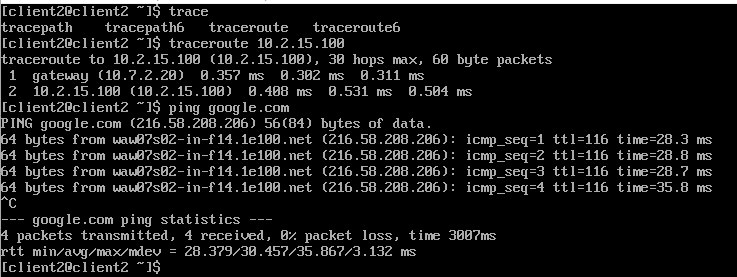

4 ) On Client 1 set IP adresses 172.17.25.1/24 and 172.17.35.1/24 for virtual interface lo and configured route to them.

To 172.17.25.1 via Server 1

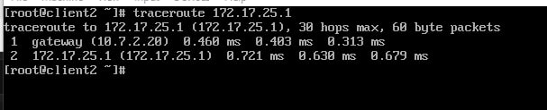

On client 2 created file route-enp0s8 with command  to configure route to 172.17.35.1.

``nano /etc/sysconfig/network-scripts/route-enp0s8``

Added to file:

ADDRESS0=172.17.35.0

NETMASK0=255.255.255.0

GATEWAY0=172.16.15.2

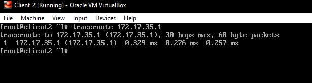

5 ) Deleted pathes that were created on previous step and summarized IP addresses. Than added this one route on Server 1 with netplan.

       routes:
     - to: 172.17.0.0/18
       via: 10.2.15.100

6 ) Installed ssh service on virtual machines with command ``sudo apt install openssh-server``. And tested connection.

From Client 1 to Server 1
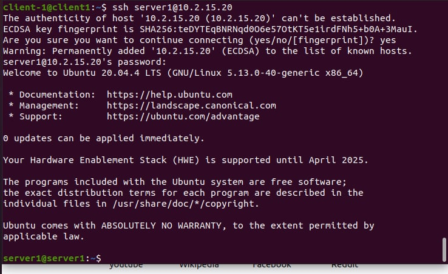

From Client 2 to Server 1

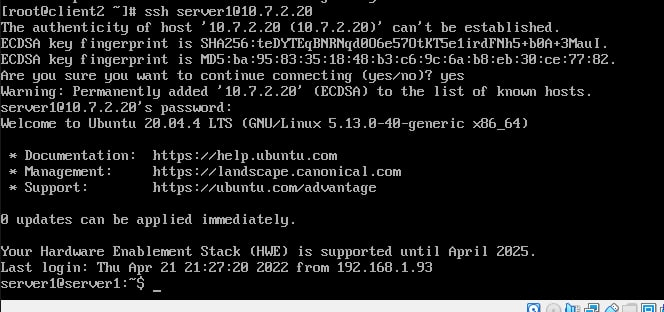

Used command ``who`` on Server 1
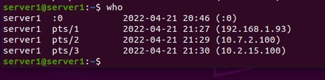

On pickture we can see 192.168.1.93 (host) 10.7.2.100(client2) and 10.2.15.100(client1) connected to server 1 with ssh.

7 ) Added firewall rule on Server 1 to allow ssh connection from Cliand 1 with command:

``sudo iptables -A INPUT -p tcp -s 10.2.15.100 --dport 22 -j ACCEPT``

And deny from Client 2 with command:

``sudo iptables -A INPUT -p tcp -s 10.7.2.100 --dport 22 -j DROP``

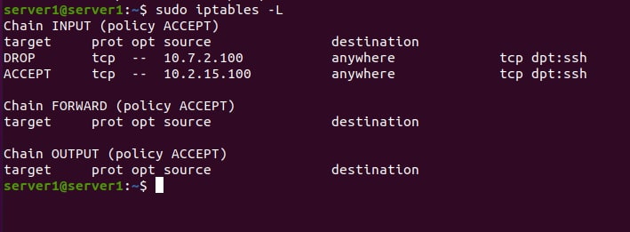

In the second part allowed ping to 172.17.25.1 (172.17.D+10.1) and denied ping to 172.17.35.1 (172.17.D+20.1) from client 2 with commands:

``sudo iptables -A FORWARD -p icmp -s 10.7.2.100 -d 172.17.25.1 -j ACCEPT``

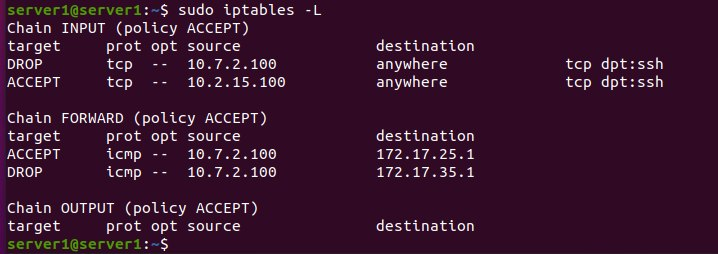

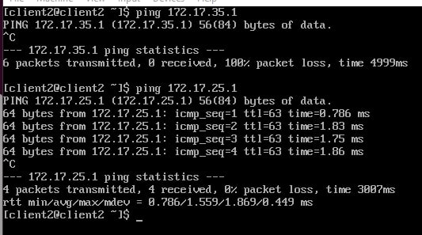

8 ) Deleted routes that were created in section 3 and on Server 1 configured NAT service so that Client 1 and Client 2 could use ping to internet. To done this used command ``sudo iptables -t nat -A POSTROUTING -s 10.0.0.0/8 -j SNAT --to-source 192.168.1.110``

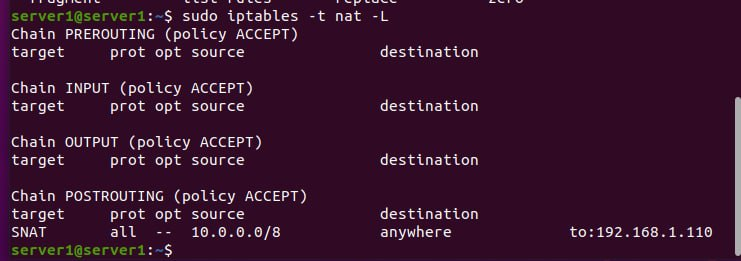

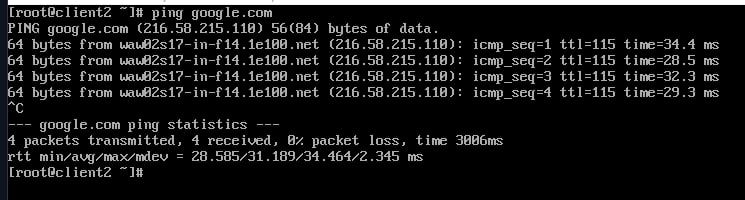