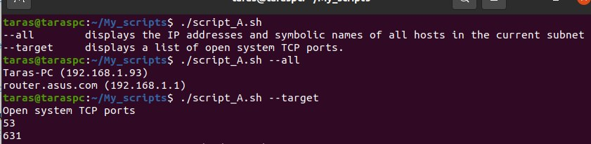
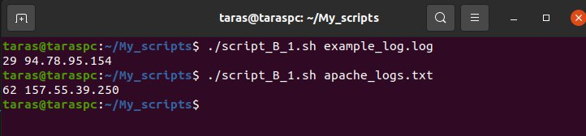
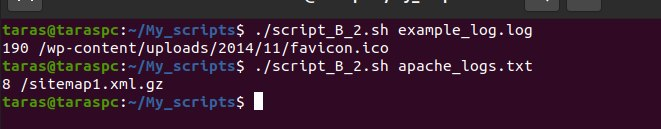
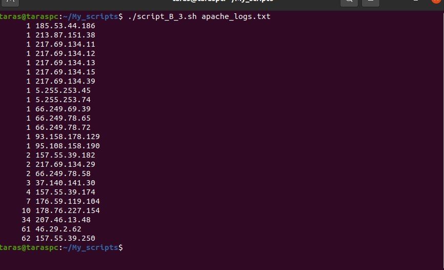
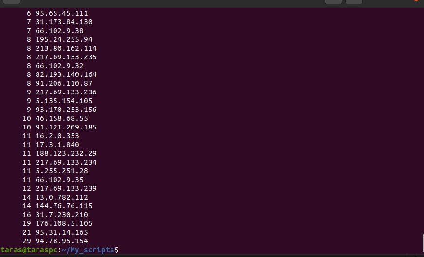
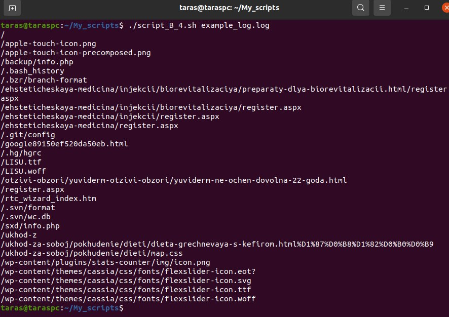
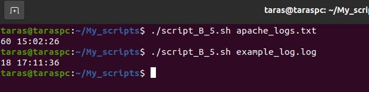
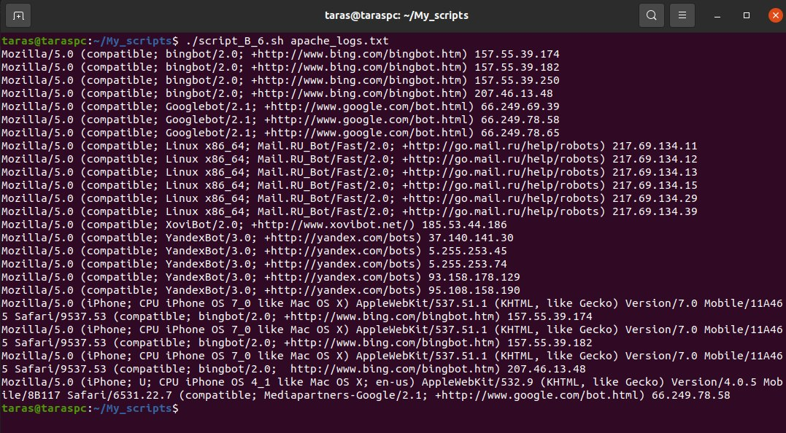
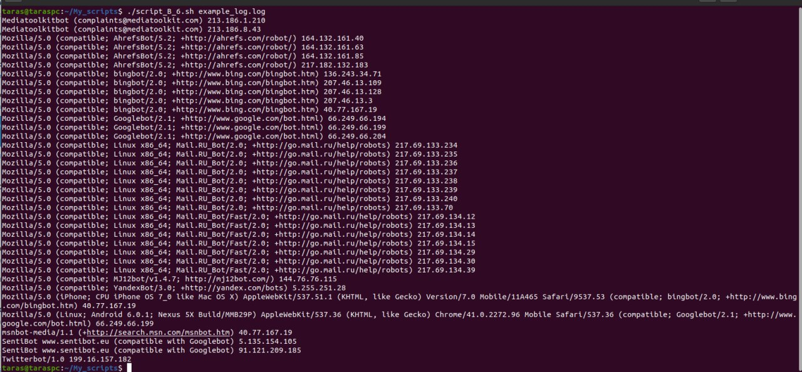
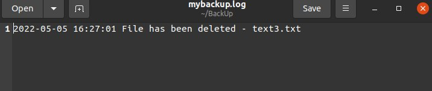

# Task 6.1

A ) Created a script that uses the --all key and --target key.

1 ) Developed function to reply that will display a list of possible keys and their description when scipt started without paramteres.

```bash
paramCheck(){
    option=$1
    if [ "$option" = "--all" ]; then
        paramAll
    elif [ "$option" = "--target" ]; then
        paramTarget
    else
        echo "--all        displays the IP addresses and symbolic names of all hosts in the current subnet
--target     displays a list of open system TCP ports."
    fi
}
```

2 ) Then created function to realise --all key that displays the IP addresses and symbolic names of all hosts in the current subnet 
```bash
paramAll(){
    arp -a | awk '{print $1, $2}'
}
```
3 ) Part with function that displays a list of open system TCP ports
with --target
```bash
paramTarget(){
    sudo lsof -i -P -n | awk ' BEGIN{print "Open system TCP ports"} /LISTEN/ {print $9}' | sed -e 's/.*://' | uniq
}
```
Then whole bash script:
```bash
#!/bin/bash

paramCheck(){
    option=$1
    if [ "$option" = "--all" ]; then
        paramAll
    elif [ "$option" = "--target" ]; then
        paramTarget
    else
        echo "--all        displays the IP addresses and symbolic names of all hosts in the current subnet
--target     displays a list of open system TCP ports."
    fi
}

paramAll(){
    arp -a | awk '{print $1, $2}'
}

paramTarget(){
    sudo lsof -i -P -n | awk ' BEGIN{print "Open system TCP ports"} /LISTEN/ {print $9}' | sed -e 's/.*://' | uniq
}

paramCheck $1
```


<br><br><br>

B ) Using Apache log example created a script to answer the following questions:

1. From 157.55.39.250 and 94.78.95.154 IP were the most requests 
```bash
#!/bin/bash
option1=$1
file_out=out_script1
grep -E -o "([0-9]{1,3}[\.]){3}[0-9]{1,3}" $option1 | sort | uniq -c | sort -gr > $file_out
{
    read line1
} < $file_out
echo $line1
```


2. **/sitemap1.xml.gz** is the most requested page. 
```bash
#!/bin/bash
option1=$1
file_out=out_script2
awk '{print $7}' $option1 | sort | uniq -c | sort -gr > $file_out
{
    read line1
} < $file_out
echo $line1
```


3. How many requests were there from each ip?
```bash
#!/bin/bash
option1=$1
file_out=out_script3
grep -E -o "([0-9]{1,3}[\.]){3}[0-9]{1,3}" $option1 | sort | uniq -c | sort -g > $file_out
cat $file_out
```

In examble_log file:


4. What non-existent pages were clients referred to?
```bash
#!/bin/bash
option1=$1
file_out=out_script4
awk '/ 404 /{print $7}' $option1 | sort | uniq > $file_out
cat $file_out
```


5. What time did site get the most requests?
```bash
#!/bin/bash
option1=$1
file_out=out_script5
grep -E -o "([0-9]{2}:){2}[0-9]{2}" $option1 | sort | uniq -c | sort -gr > $file_out
{
    read line1
} < $file_out
echo $line1
```


6. What search bots have accessed the site?
```bash
#!/bin/bash
option1=$1
file_out=out_script6
awk -F'"' '$6 ~ /bot/ {print $6, $1}' $option1 | sed 's/- -.*]//' | sort | uniq > $file_out
cat $file_out
```
For apache.log file


For exmaple.log file

<br><br><br>

C ) Created a data backup script that takes path to the syncing directory and the path to the directory where the copies of the files will be stored as the parameters. Also in case of adding new or deleting old files, the script add a corresponding entry to the log file with the time, type of operation and the file name.

```bash
#!/bin/bash

src_path=$1
dst_path=$2
LOG_File=$2/mybackup.log
TIMESTAMP=`date "+%Y-%m-%d %H:%M:%S"`

if [ -d $dst_path ] ; then
    for file in $(find $src_path -printf "%P\n") ; do
        if [ -a $dst_path/$file ] ; then
            if [ $src_path/$file -nt $dst_path/$file ] ; then 
                echo "$TIMESTAMP New file - $file" >> $LOG_File
                cp -r $src_path/$file $dst_path/$file
            fi
        else
            cp -r $src_path/$file $dst_path/$file
        fi
    done
    for file in $(find $dst_path -printf "%P\n") ; do
        if [[ ! -a $src_path/$file && $file != mybackup.log ]]; then
            echo "$TIMESTAMP File has been deleted - $file" >> $LOG_File
            rm -rf $dst_path/$file
        fi
    done
else
cp -a $src_path $dst_path
touch $LOG_File
fi
```

Added this script to crontab with a run frequency of one minute by running command crontab -e and adding to file line 

<b>* * * * * /home/taras/My_scripts/script_C.sh /home/taras/Sourcefl /home/taras/BackUp</b>

For example I deleted text3.txt file after backup was made and got the next message in log:
