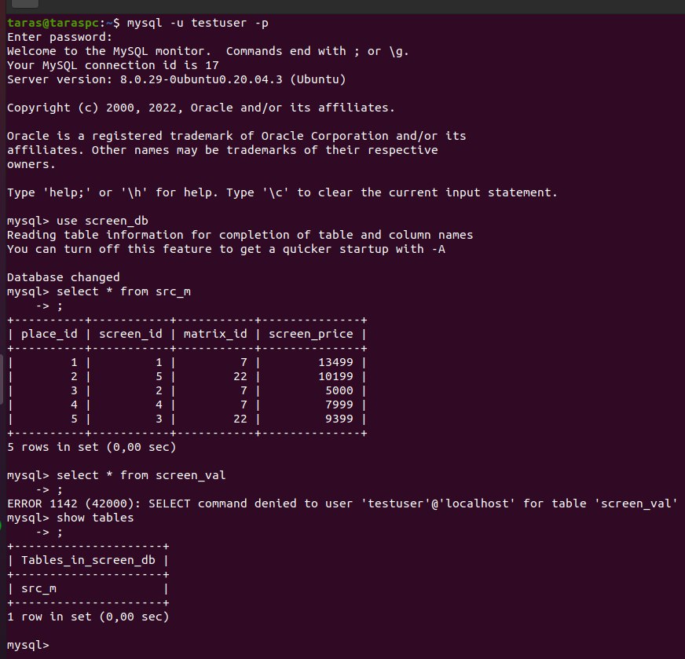

# Task 7.1

1-2 ) Downloaded and installed MySQL server on Ubuntu VM.<br>
3 ) The database logical schema of monitors will be:


And the physical schema will be based on SQL to construct a database with tables.

4 ) Created database with query:
```sql
CREATE DATABASE screen_db;
```
And after that used this database.
```sql
USE testdb;
```
5 ) Created tables with queries :
```sql
CREATE TABLE IF NOT EXISTS screen_val ( 
    screen_id INT AUTO_INCREMENT PRIMARY KEY, 
    screen_name VARCHAR(45) NOT NULL, 
    screen_resol VARCHAR(45) );

CREATE TABLE IF NOT EXISTS screen_matrix ( 
    matrix_id INT PRIMARY KEY, 
    matrix_name VARCHAR(45) NOT NULL );

CREATE TABLE IF NOT EXISTS screen_main ( 
    place_id INT AUTO_INCREMENT PRIMARY KEY, 
    screen_id INT, 
    matrix_id INT, 
    screen_price INT );
```

After what filled tables with example of query:
```sql
INSERT INTO table_name VALUES (val1,val2,val3)
```


6 )  Constructed and executed SELECT operator with WHERE, GROUP BY and ORDER BY:

```sql
SELECT screen_resol, sum(screen_price) FROM screen_main sm, screen_val sv, screen_matrix sma WHERE sm.screen_id=sv.screen_id AND sm.matrix_id=sma.matrix_id AND matrix_name= "IPS" GROUP BY screen_resol ORDER BY 2;
```
<br>

7 ) Executed other DDL, DML, DCL queries: 

Data Definition Language: 
```sql
ALTER TABLE screen_val ADD diagonal INT NULL;

RENAME TABLE screen_main to src_m;
```
Data Manipulation Language:
```sql
UPDATE screen_val SET diagonal=27 where screen_id = 1;

INSERT INTO screen_val (screen_name, screen_resol, diagonal) VALUES ('SE2722H', '1920x1080', 27);
```
Data Control Language:
```sql
GRANT ALL PRIVILEGES ON scr_m TO 'taras'@'localhost' WITH GRANT OPTION;
```

8 ) Creating Another Super User:
```sql
GRANT ALL PRIVILEGES ON *.* TO 'taras'@'localhost';
```
Then created few new users: 
```sql
CREATE USER 'user2'@'localhost' IDENTIFIED BY '123321';

CREATE USER 'testuser'@'localhost' IDENTIFIED BY '123321';
```

Granting them privileges:
```sql
GRANT SELECT ON screen_db.* TO 'user2'@'localhost';

GRANT SELECT ON screen_db.src_m TO 'testuser'@'localhost';
```
Then as user2 tryed to execute several queries:
<br>

And then tryed the same as the testuser
<br>

9 ) As root used selection from the main MySQL DB.

<br>
<br>
<br>

10 ) Created a backup of database with command:

``
sudo mysqldump -u root -p screen_db > screen_db001.sql
``

<br>

11 ) Deleted database screen_db.

<br>

12 ) Then restored this database.
<br>

13 ) Transfered screen_db database to RDS AWS.

<br>

14 ) Connected to RDS AWS database.

<br>

15 ) Executed query similar from step 6

<br>

16 ) After that created dump from RDS.

<br>

17 ) Created and connected to mongoDB database.

<br>

18 ) Created collection.

<br>

19 ) Created some documents and inserted a couple of documents into collection.

<br>

20 ) Used command **find**.

<br>

<br>