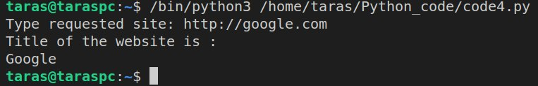
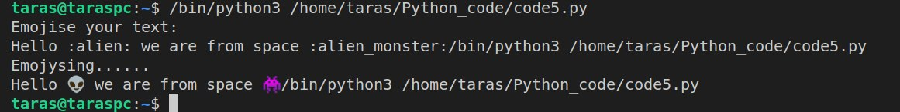
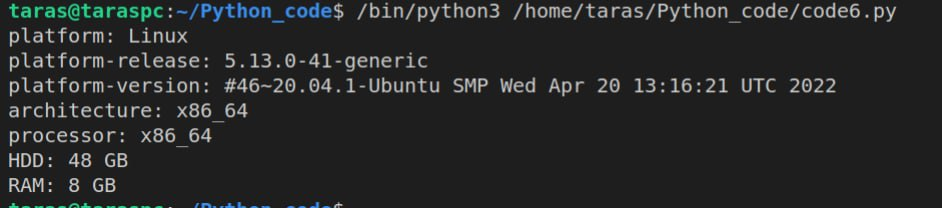

# Task 8.1

Writed programs on python that:

1 ) will display current date and time

```python
from datetime import datetime

now = datetime.now()
dt_string = now.strftime("%d/%m/%Y %H:%M:%S")
print("current date and time =", dt_string)
```

2 ) will accept comma-separated numbers, and then write tuple and list of them
```python
try:
    entr_nums = input("Enter numbers: ")
    print("Output:")
    list_nums = [int(i) for i in entr_nums.split(',')] 
    tuple_nums = tuple(int(i) for i in entr_nums.split(',')) 
    print('List: ', list_nums)
    print('Tuple: ', tuple_nums)
except ValueError:
    print('Wrong enter, please enter numbers separated by commans.')
```

3 ) will ask file name then file read it and will show only even lines.
```python
fl_path = input("Enter path to file: ")

file = open(fl_path, 'r')
line = 0
myline = file.readline()
while myline:
    line += 1
    if line % 2 == 0:
        print(line, myline)
    myline = file.readline()
file.close()
```


4 )  will read html document, parse it, and show it’s 
title.

```python
import requests
from bs4 import BeautifulSoup
 
url = input('Type requested site: ')
 
reqs = requests.get(url)
 
soup = BeautifulSoup(reqs.text, 'html.parser')

print("Title of the website is : ")
for title in soup.find_all('title'):
    print(title.get_text())
```


5 ) will parse user’s text, and replace some emotions with emoji’s
```python
import emoji
import re

x = input("Emojise your text:\n")
emojis = re.findall(f' :\w+:', x)

for emjs in emojis:
    x = re.sub(emjs, emoji.emojize(emjs), x)

print("Emojysing......")
print(x)
```



6 )  will show basic PC information

```python
import platform, psutil

info={}
info['platform'] = platform.system()
info['platform-release'] = platform.release()
info['platform-version'] = platform.version()
info['architecture'] = platform.machine()
info['processor'] = platform.processor()
info['HDD'] = str(round(psutil.disk_usage('/').total / (1024.0 **3)))+" GB"
info['RAM'] = str(round(psutil.virtual_memory().total / (1024.0 **3)))+" GB"

for objects in info:
    print(objects + ":", info[objects])
```
